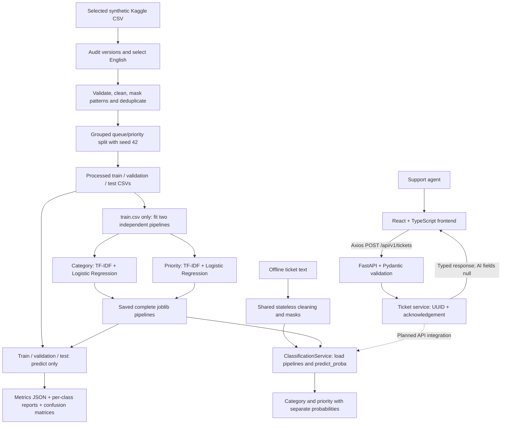

# Days 1 and 2 architecture

Solid arrows describe implemented workflows. Day 1 HTTP intake and Day 2 offline ML are separate: the dashed API integration is planned. The ticket service reads no dataset, model or knowledge-base files. GET `/health` reports process health, not model readiness.

Routes own HTTP contracts; Pydantic schemas validate inputs and describe outputs; the ticket service owns acknowledgements. Settings load backend environment configuration, and Axios centralizes the frontend URL and timeout. One page needs no router. No database, background worker, authentication system or external AI service is required. Models are needed only for the separate classification service.

The API trims surrounding whitespace and accepts 1-10,000 Unicode characters. Missing, blank, wrong-type, oversized, or extra input fields produce HTTP 422. It returns HTTP 200 with a fresh UUID, echoed normalized text, null predictions, and `received` status. IDs are acknowledgement IDs only; tickets are not persisted and there is no lookup endpoint.

The preprocessing command is an offline Day 1 workflow; the API does not need to load data to acknowledge tickets. It uses all selected-file versions and targets 70/15/15 with queue/priority stratification and indivisible related-ticket groups. The 16,338 English rows produce 11,436/2,451/2,451 outputs. Answers and other metadata are preserved separately in historical_tickets.csv; the classification inputs contain only subject/body text. It uses no model, tokenizer, embeddings or external service.

`baseline_data.py` loads only the four-column classification splits, verifies their audit hashes when available and rejects duplicate IDs/normalized text. `baseline_models.py` fits both vectorizers/classifiers exclusively on training text and labels, with a fixed 50,000-feature limit and one numerical thread. `evaluation.py` performs prediction-only evaluation and exports reports. Validation and test never enter a fit call. Answers are never read. The two targets have separate pipelines, not combined labels.

`classification_service.py` loads both trusted local artifacts once. It applies the same stateless cleaning/masking used when loading training text, then each saved pipeline performs TF-IDF transformation and classification. It returns a `ClassificationPrediction` dataclass with `category`, `category_confidence`, `priority`, and `priority_confidence`; probabilities come directly from the predicted class in `predict_proba`. `predict_examples.py` is the executable consumer. See [configuration, artifacts and measured results](baseline-ml.md).

Future phases can integrate this service while preserving the existing response fields. New response fields should be optional; incompatible changes require API versioning. The trained models preserve all ten source queue labels and lowercase low/medium/high priorities. The legacy API response literals remain unchanged because prediction integration has not begun; their vocabularies must be addressed explicitly at integration time. Later experiments should reuse the saved split files. Tuning, deep learning, retrieval, RAG and investigation remain planned.

Local development uses Vite on 5173 and Uvicorn on 8000. Docker builds static frontend files served by Nginx on host port 5173 and runs Uvicorn on 8000. The browser calls the public backend URL, not the Docker service hostname. CORS uses an explicit configurable origin list.
