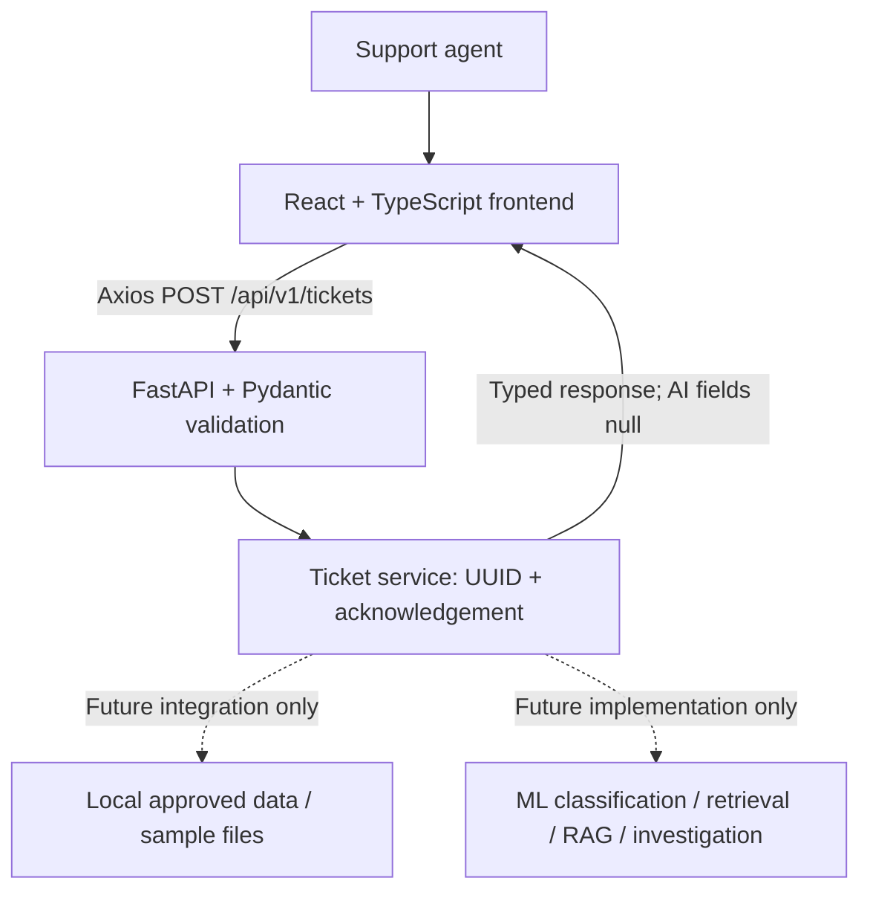

# Day 1 architecture

Solid arrows describe the running Day 1 workflow. Dashed arrows are future connections; the service currently reads no dataset or knowledge-base files. GET `/health` reports process health, not model readiness.

Routes own HTTP contracts; Pydantic schemas validate inputs and describe outputs; the service owns ticket handling. Settings load backend environment configuration, and Axios centralizes the frontend URL and timeout. One page needs no router. No database, background worker, model, authentication system, or external AI service is required.

The API trims surrounding whitespace and accepts 1-10,000 Unicode characters. Missing, blank, wrong-type, oversized, or extra input fields produce HTTP 422. It returns HTTP 200 with a fresh UUID, echoed normalized text, null predictions, and `received` status. IDs are acknowledgement IDs only; tickets are not persisted and there is no lookup endpoint.

Future phases can replace `receive_ticket` internals while preserving the existing response fields. New response fields should be optional; incompatible changes require API versioning. Category and priority vocabularies are provisional and should be reviewed against the approved dataset.

Local development uses Vite on 5173 and Uvicorn on 8000. Docker builds static frontend files served by Nginx on host port 5173 and runs Uvicorn on 8000. The browser calls the public backend URL, not the Docker service hostname. CORS uses an explicit configurable origin list.
