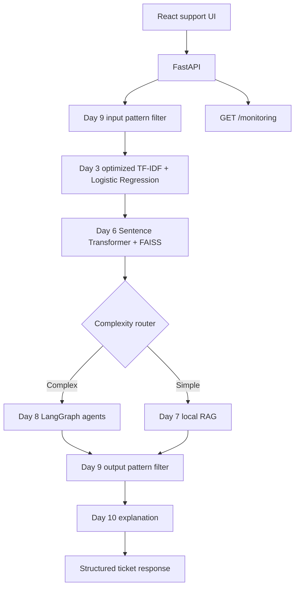

# Application Architecture

This document describes the implemented POC. The historical Day 1/2 design is superseded by the integrated flow in [final-architecture.md](final-architecture.md).

```mermaid
flowchart TD
    UI[React support UI] --> API[FastAPI]
    API --> Input[Day 9 input pattern filter]
    Input --> Classify[Day 3 optimized TF-IDF + Logistic Regression]
    Classify --> Retrieve[Day 6 Sentence Transformer + FAISS]
    Retrieve --> Route{Complexity router}
    Route -->|Simple| RAG[Day 7 local RAG]
    Route -->|Complex| Agents[Day 8 LangGraph agents]
    Agents --> Output[Day 9 output pattern filter]
    RAG --> Output
    Output --> Explain[Day 10 explanation]
    Explain --> Response[Structured ticket response]
    API --> Monitor[GET /monitoring]
```

## Runtime Flow

`POST /api/v1/tickets` accepts a subject/body pair (or the legacy `ticket_text` field), classifies category and priority using saved Day 3 models, retrieves similar training tickets from the Day 6 FAISS index, and applies deterministic complexity routing. Simple tickets use the Day 7 grounded RAG path. Complex tickets use the Day 8 Investigation, Retrieval and Resolution agents; the Retrieval Agent uses the same FAISS service as a tool. All workflow context is request-local.

The Day 9 deterministic input/output pattern filter blocks or redacts its limited set of known patterns and treats retrieved content as untrusted data. It is a POC guardrail demonstration, not a comprehensive security system. Day 10 returns linear TF-IDF feature contributions for the category result.

`GET /health` is a cheap artifact-availability check. `GET /monitoring` returns in-memory, process-local request/error and latency counters, model/retrieval activity counters, and saved category Macro-F1 and retrieval Recall@3 values. These counters reset whenever the backend process restarts.

## Offline Assets

The selected synthetic Kaggle CSV is processed into deterministic train/validation/test splits. The Day 3 classifiers are fitted on training data. The Day 6 retrieval corpus contains training historical tickets only; validation and test tickets are held-out evaluation queries and are not indexed. Day 11 supplies local file-based MLflow tracking, a daily manually triggerable Airflow index-refresh DAG, and CI workflows for backend validation, frontend type checking/building, and Docker validation where the runner supports it.

## POC Boundaries

The implementation uses local artifacts and a synthetic dataset. It has no ticket persistence, authentication/RBAC, production vector database, cloud deployment, persistent agent memory, production observability, or guarantee of support-answer quality. See [assumptions.md](assumptions.md) and [final-evaluation.md](final-evaluation.md) for scope and measured results.
