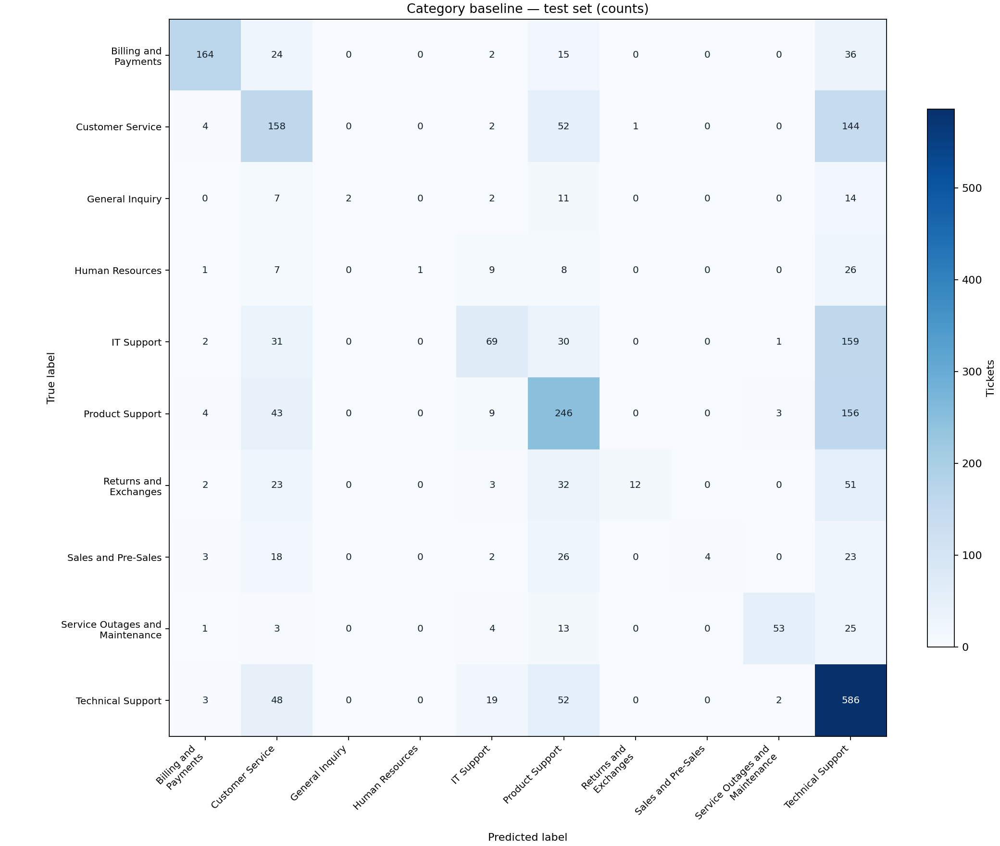
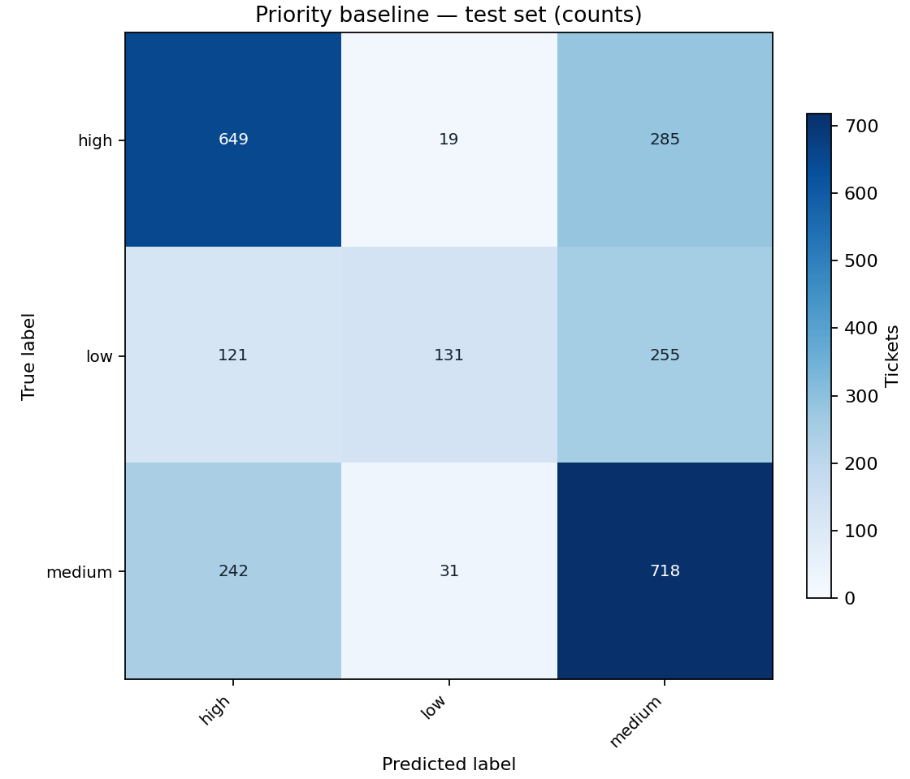

# Day 2: baseline ML classification

## Objective and scope

Establish a reproducible reference for two independent tasks: `ticket_text -> category` and `ticket_text -> priority`. Both use scikit-learn TF-IDF + Logistic Regression. Day 2 is complete; hyperparameter optimization and all later AI features remain unimplemented. The existing HTTP endpoint still acknowledges tickets with null classification fields.

## Dataset and leakage controls

The only source is the selected synthetic Kaggle file `data/raw/aa_dataset-tickets-multi-lang-5-2-50-version.csv`. The existing English splits are unchanged: **16,338 tickets**, comprising **11,436 train**, **2,451 validation**, and **2,451 test**. All ten categories and low/medium/high priorities are retained. See [the dataset audit](dataset.md) for provenance, distributions and limitations.

Each CSV must contain exactly `ticket_id,ticket_text,category,priority`. The sole feature is `ticket_text = subject + body`, prepared by the existing conservative cleaner and privacy masks. IDs are metadata. Answers, tags and other outcome metadata are excluded. Training never reads `historical_tickets.csv` or raw data.

`baseline_data.py` validates every split, known labels, nonempty text, duplicate IDs and normalized text within/across splits. When `dataset_audit.json` exists, the saved hashes must match. Both complete pipelines are fitted only on train text and their respective train labels. Validation and test are transformed/predicted only. Both models are fixed before any held-out evaluation; no test-driven selection or configuration changes occurred.

## Fixed configuration

```json
{
  "class_weight": null,
  "feature": "ticket_text",
  "hyperparameter_search": false,
  "logistic_regression": {
    "C": 1.0,
    "class_weight": null,
    "fit_intercept": true,
    "l1_ratio": 0.0,
    "max_iter": 1000,
    "solver": "lbfgs",
    "tol": 0.0001
  },
  "numeric_threads": 1,
  "resampling": false,
  "seed": 42,
  "tfidf": {
    "lowercase": true,
    "max_df": 0.95,
    "max_features": 50000,
    "min_df": 2,
    "ngram_range": [
      1,
      2
    ],
    "strip_accents": "unicode",
    "sublinear_tf": true
  }
}
```

The vectorizer also uses scikit-learn's defaults: word tokenization, tokens of at least two word characters, no stop-word list, `norm="l2"`, `use_idf=True`, `smooth_idf=True`, `binary=False`, and float64 sparse features. Each target has its own fitted vectorizer. The 50,000-feature cap was chosen before evaluation to bound memory on a developer machine, not through model search. Both fitted vocabularies reach that cap.

Logistic Regression uses standard L2 regularization (`l1_ratio=0.0` in scikit-learn 1.9), `C=1.0`, `solver="lbfgs"`, `tol=0.0001`, `fit_intercept=True`, `max_iter=1000`, and seed 42. Numerical thread pools are limited to one during training/evaluation to avoid oversubscription. A convergence warning fails training instead of silently exporting an unconverged result.

`class_weight=None` establishes the requested standard unmodified baseline. The largest English category has 4,737 records and the smallest 236, so weighting could matter in future work, but no balancing, resampling, synthetic text generation or search was used here. This experiment preserves the weak minority-class results for comparison.

## Commands

From the repository root in PowerShell:

```powershell
.\backend\.venv\Scripts\python.exe -m pip install -r backend/requirements.txt
.\backend\.venv\Scripts\python.exe -m backend.app.ml.baseline_models
.\backend\.venv\Scripts\python.exe -m backend.app.ml.predict_examples
.\backend\.venv\Scripts\python.exe -m pytest -c backend/pytest.ini -q backend/tests
```

From `backend`, use `.\.venv\Scripts\python.exe -m app.ml.baseline_models` and `-m app.ml.predict_examples`. On Linux/macOS replace the executable with `backend/.venv/bin/python` or `.venv/bin/python`, respectively. Default data/artifact paths resolve relative to the repository rather than the current directory. The training CLI supports `--data-dir`, `--output-dir`, and `--seed`; no search command is provided. Do not rerun preprocessing to train on the existing splits.

Training loads splits, fits both models, evaluates all three splits, stages full pipelines/reports, saves them under `experiments/baseline`, and prints validation/test macro-F1. Repeating training replaces those named artifacts. The examples command supports `--model-dir` and `--output` and writes actual predictions to `example_predictions.json`.

## Measured results

The following tables were generated from `experiments/baseline/baseline_results.json`, not manually entered. All scores are fractions from 0 to 1. Macro averages give each class equal weight; weighted averages use class support. Weighted recall equals accuracy for these single-label tasks. Undefined precision/recall is reported as zero (`zero_division=0`); all labels and supports are included.

### Category

| Metric | Train | Validation | Test |
| --- | ---: | ---: | ---: |
| accuracy | 0.752361 | 0.518972 | 0.528356 |
| precision_macro | 0.899919 | 0.570483 | 0.770694 |
| recall_macro | 0.546385 | 0.334622 | 0.347378 |
| f1_macro | 0.605512 | 0.360404 | 0.376067 |
| precision_weighted | 0.800518 | 0.563171 | 0.603921 |
| recall_weighted | 0.752361 | 0.518972 | 0.528356 |
| f1_weighted | 0.735652 | 0.484437 | 0.495198 |

#### Test per-class report

| Class | Precision | Recall | F1 | Support |
| --- | ---: | ---: | ---: | ---: |
| Billing and Payments | 0.891304 | 0.680498 | 0.771765 | 241 |
| Customer Service | 0.436464 | 0.437673 | 0.437068 | 361 |
| General Inquiry | 1.000000 | 0.055556 | 0.105263 | 36 |
| Human Resources | 1.000000 | 0.019231 | 0.037736 | 52 |
| IT Support | 0.570248 | 0.236301 | 0.334140 | 292 |
| Product Support | 0.507216 | 0.533623 | 0.520085 | 461 |
| Returns and Exchanges | 0.923077 | 0.097561 | 0.176471 | 123 |
| Sales and Pre-Sales | 1.000000 | 0.052632 | 0.100000 | 76 |
| Service Outages and Maintenance | 0.898305 | 0.535354 | 0.670886 | 99 |
| Technical Support | 0.480328 | 0.825352 | 0.607254 | 710 |

### Priority

| Metric | Train | Validation | Test |
| --- | ---: | ---: | ---: |
| accuracy | 0.870147 | 0.616891 | 0.611179 |
| precision_macro | 0.895147 | 0.641496 | 0.645269 |
| recall_macro | 0.836495 | 0.562339 | 0.554637 |
| f1_macro | 0.854481 | 0.568881 | 0.559960 |
| precision_weighted | 0.879033 | 0.631345 | 0.629832 |
| recall_weighted | 0.870147 | 0.616891 | 0.611179 |
| f1_weighted | 0.866927 | 0.601422 | 0.593776 |

#### Test per-class report

| Class | Precision | Recall | F1 | Support |
| --- | ---: | ---: | ---: | ---: |
| high | 0.641304 | 0.681007 | 0.660560 | 953 |
| low | 0.723757 | 0.258383 | 0.380814 | 507 |
| medium | 0.570747 | 0.724521 | 0.638506 | 991 |


Category performance shows a substantial train-to-held-out gap and weak recall for minority queues. Perfect precision on very few minority predictions should not be read as strong overall performance. The confusion matrix exposes a strong tendency to predict Technical Support. Priority also has a train-to-held-out gap and under-predicts low-priority tickets. No parameters were changed after viewing these results.

The JSON includes per-class reports and confusion-matrix arrays for every split, plus configuration, dependency versions, input hashes, label distributions, vocabulary sizes, iteration counts and saved model hashes. The separate [generated Markdown report](../experiments/baseline/baseline_results.md) is regenerated by every training run.

## Confusion matrices and artifacts

Both images were visually checked for readable labels and counts. Rows are true labels; columns are predicted labels. The PNG and labelled CSV files show the final test set; all split matrices also exist in JSON.





Files in `experiments/baseline/`:

- `models/category_tfidf_logreg.joblib`: full category vectorizer + classifier.
- `models/priority_tfidf_logreg.joblib`: full priority vectorizer + classifier.
- `baseline_results.json`: machine-readable configuration and results.
- `baseline_results.md`: generated aggregate and test per-class tables.
- `category_confusion_matrix.png` and `category_confusion_matrix.csv`.
- `priority_confusion_matrix.png` and `priority_confusion_matrix.csv`.
- `example_predictions.json`: actual saved-model sanity predictions.

Existing `.gitignore` rules exclude joblib artifacts; no ignore-rule changes were needed for Day 2. Train locally to regenerate them. Pipeline serialization contains built-in scikit-learn components, so the root `backend.app` and backend-directory `app` invocation styles are compatible. Only load trusted local joblib files and use compatible training/inference library versions; cross-version loading is not supported by scikit-learn.

## Standalone inference and actual examples

`ClassificationService` loads both artifacts once and returns a frozen `ClassificationPrediction` with `category`, `category_confidence`, `priority`, and `priority_confidence`. Missing or invalid artifacts produce clear errors. Blank/non-string tickets are rejected. The shared stateless cleaner/masks are applied before the saved TF-IDF step, matching training preparation.

From the repository root after training:

```python
from backend.app.services.classification_service import ClassificationService

service = ClassificationService()
prediction = service.predict("My payment failed while placing an order.")
print(prediction)
```

Each confidence is the probability for the winning class from its own model's `predict_proba`, aligned with `classes_`. These are uncalibrated model probabilities, not verified correctness or production confidence thresholds. No arbitrary confidence constant is used. Neither service nor models are connected to `POST /api/v1/tickets`; its existing schema and null fields are unchanged.

The following are actual outputs of `predict_examples.py`, loaded from `example_predictions.json`. These short, manually written inputs have no gold labels and are sanity checks only; unexpected predictions are retained honestly.

| Input | Category | Category confidence | Priority | Priority confidence |
| --- | --- | ---: | --- | ---: |
| My payment failed while placing an order. | Billing and Payments | 0.535684 | medium | 0.439561 |
| I was charged twice for the same order. | Technical Support | 0.242276 | high | 0.638685 |
| I cannot log into my account. | Technical Support | 0.350820 | medium | 0.445056 |
| My package has not arrived yet. | Technical Support | 0.266741 | medium | 0.389185 |
| Our production network is down and all employees are unable to work. Please restore service urgently. | Technical Support | 0.240547 | high | 0.630405 |
| Where can I find the employee vacation policy and benefits handbook? | Product Support | 0.212187 | high | 0.350433 |
| Could you send pricing and a product demonstration for your enterprise plan? | Billing and Payments | 0.324441 | medium | 0.572800 |

## Reproducibility and validation

Measured environment:

```json
{
  "joblib": "1.5.3",
  "matplotlib": "3.10.9",
  "numpy": "2.5.3",
  "python": "3.14.4",
  "scikit-learn": "1.9.1",
  "scipy": "1.18.1",
  "threadpoolctl": "3.7.0"
}
```

Convergence iterations: category 112, priority 59. Both models converged within 1,000 iterations.

Two complete training/evaluation runs using the same environment, input hashes, seed and configuration produced identical result JSON, model hashes and bytes, generated Markdown, PNGs and CSVs. No configuration changed between runs. Different library versions, numerical libraries or runtimes can introduce numerical differences; recorded versions are part of the reproducibility record. Requirements use bounded ranges following repository convention, so retain the recorded environment for exact reproduction.

The 24 new Day 2 tests use lightweight real classifiers. They cover strict loading/labels, cross-split leakage, audit mismatch, answer exclusion, exact training fit inputs, held-out vocabulary exclusion, evaluation without mutation, artifact export/load errors, real probabilities, invalid input and deterministic predictions/training. Existing API/data tests remain unchanged. See [the validation record](validation.md) for final local, Docker and application checks.

## Limitations and Day 3 boundary

- Synthetic English-only data and source label quality limit generalization to real customer tickets and other languages.
- Exact/grouped split checks cannot rule out every paraphrase or generation-template relationship.
- Fixed lexical features and unweighted classification miss many minority-category and low-priority tickets; high aggregate precision can obscure low recall.
- No probability calibration, hyperparameter optimization, deep-learning comparison, retrieval, RAG or API integration is included.
- Privacy masking reuses Day 1 preprocessing; it is not a new runtime security implementation or a guarantee that text is PII-free.

**Day 3 hyperparameter optimization has NOT been implemented.** Grid Search, Random Search and Bayesian Optimization are all NOT IMPLEMENTED.

Implementation references: [TF-IDF](https://scikit-learn.org/stable/modules/generated/sklearn.feature_extraction.text.TfidfVectorizer.html), [Logistic Regression and predict_proba](https://scikit-learn.org/stable/modules/generated/sklearn.linear_model.LogisticRegression.html), and [model persistence/version compatibility](https://scikit-learn.org/stable/model_persistence.html).
