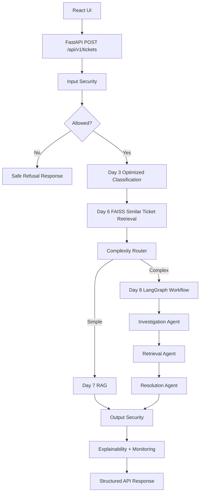

# Final Architecture

This POC integrates local classification, retrieval, RAG, agents, security, explainability and monitoring behind one FastAPI endpoint and React UI. It is intentionally lightweight and does not include production persistence, authentication, cloud deployment or streaming.

## Components

- React UI: collects ticket subject and body, posts `top_k`, and displays classification, similar tickets, workflow, response, sources, security, explanation and timings.
- FastAPI: exposes `/health` and `/api/v1/tickets`. Health remains cheap and checks artifact availability only.
- Input security: deterministic Day 9 checks block prompt injection, jailbreaks and secret requests before the AI workflow. Explicit PII is redacted before allowed workflow execution.
- Classification: saved Day 3 optimized TF-IDF + Logistic Regression models predict category and priority with uncalibrated probabilities.
- Retrieval: Day 6 Sentence Transformer embeddings and FAISS `IndexFlatIP` return similar training historical tickets with metadata.
- Complexity router: deterministic POC routing sends simple tickets to direct RAG and complex tickets through LangGraph.
- RAG: Day 7 retrieval-grounded response generation returns insufficient information instead of fabricating when evidence is weak.
- LangGraph workflow: Day 8 orchestrates Investigation, Retrieval and Resolution agents with request-local state and trace.
- Output security: Day 9 output check blocks obvious secret or PII leakage and returns a safe fallback.
- Explainability: Day 10-style linear TF-IDF contribution scores explain category predictions.
- Monitoring: Day 11 in-memory counters track request, model prediction and retrieval metrics.

## Boundaries

The system uses synthetic data and local artifacts. It does not persist tickets, authenticate users, provide RBAC, run a production vector database, use hosted LLM APIs, or guarantee production support-answer quality.
